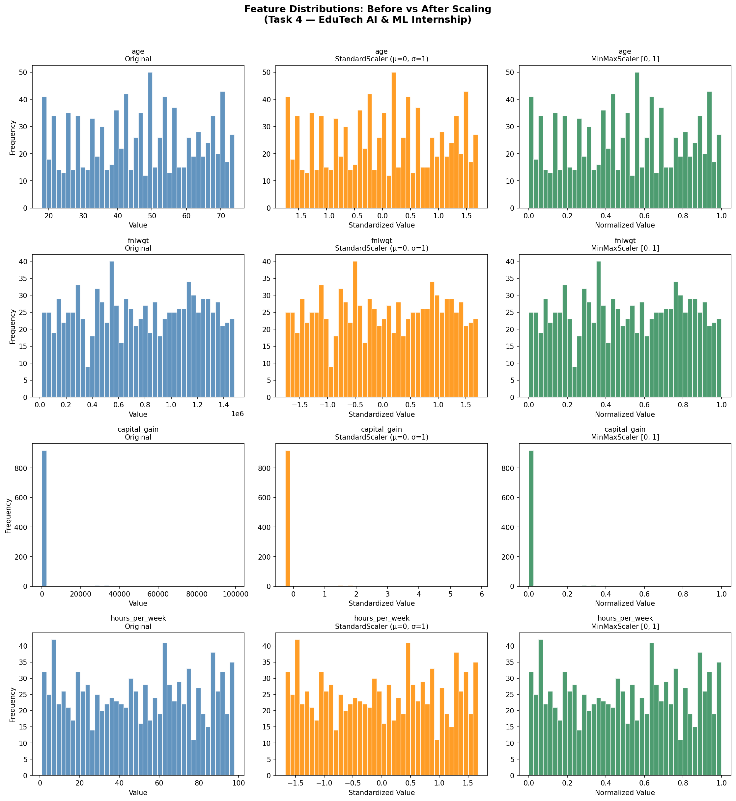
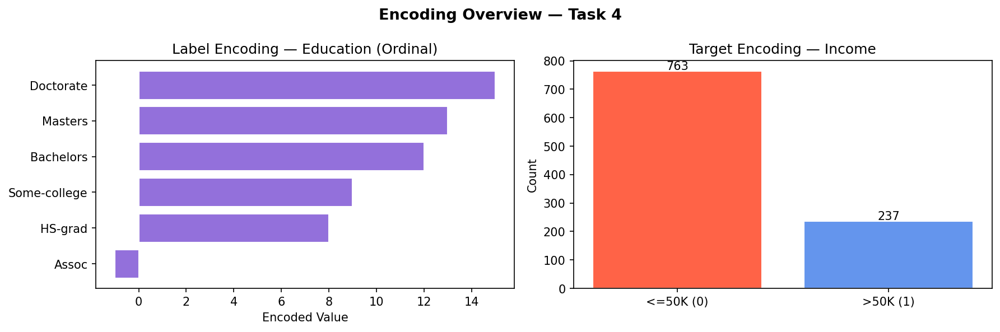

# 🔢 Task 4: Feature Encoding & Scaling
### AI & ML Internship — EduTech Solutions

---

## 📌 Objective
Convert categorical features into numerical formats and bring all numerical features to a similar scale for better Machine Learning model performance.

---

## 📂 Repository Structure

```
├── feature_encoding_scaling.py   ← Main Python script
├── adult_census_processed.csv    ← Final ML-ready processed dataset
├── scaling_comparison.png        ← Before vs After scaling plots
├── encoding_overview.png         ← Encoding visualizations
├── Task-4-Documentation.pdf      ← Detailed task documentation report
└── README.md                     ← This file
```

---

## 📊 Dataset
**Adult Census Income Dataset** (UCI Machine Learning Repository)
- ~32,000+ records, 14 features + 1 target
- Mix of categorical (nominal & ordinal) and numerical features
- Target: `income` — whether a person earns `>50K` or `<=50K`

---

## 🛠️ Tools & Libraries
| Tool | Purpose |
|------|---------|
| Python 3 | Core language |
| Pandas | Data manipulation |
| NumPy | Numerical operations |
| Scikit-learn | Encoding & Scaling |
| Matplotlib / Seaborn | Visualizations |

---

## 🔄 Steps Performed

### Step 1 — Data Cleaning
- Loaded dataset and dropped rows with missing values (`?` entries)

### Step 2 — Identify Variable Types
| Type | Features |
|------|----------|
| **Ordinal** (Label Encode) | `education` |
| **Nominal** (One-Hot Encode) | `workclass`, `marital_status`, `occupation`, `relationship`, `race`, `sex`, `native_country` |
| **Numerical** (Scale) | `age`, `fnlwgt`, `education_num`, `capital_gain`, `capital_loss`, `hours_per_week` |

### Step 3 — Label Encoding (Ordinal)
- Applied custom ordered `LabelEncoder` to `education`
- Order: `Preschool → 1st-4th → ... → Bachelors → Masters → Doctorate`
- **Why?** Education has a natural progression; encoding preserves that meaningful numeric order

### Step 4 — One-Hot Encoding (Nominal)
- Used `pd.get_dummies(drop_first=True)` for all nominal features
- `drop_first=True` **avoids the Dummy Variable Trap** (multicollinearity)
- **Why?** Nominal features have no inherent order — numeric codes would mislead models

### Step 5 — Feature Scaling

| Scaler | Formula | When to use |
|--------|---------|-------------|
| **StandardScaler** | `z = (x − μ) / σ` | Gaussian distributions; Logistic Regression, SVM, PCA |
| **MinMaxScaler** | `x_norm = (x − min) / (max − min)` | Neural Networks, KNN; bounded [0,1] range needed |

- Both scalers applied and compared side-by-side
- **Chosen for final output:** StandardScaler (dataset contains outliers; Z-score is more robust)

### Step 6 — Visualization
- Histograms comparing distributions **before** and **after** scaling for 4 key features
- Encoding overview bar charts for Label and Target encoding

---

## 📸 Output Visualizations

### Scaling Comparison


### Encoding Overview


---

## 💡 Key Concepts Covered

### ❓ Difference between Label Encoding & One-Hot Encoding?
- **Label Encoding** assigns integer values (0, 1, 2, …) to categories — suitable for *ordinal* features where order matters
- **One-Hot Encoding** creates binary columns for each category — suitable for *nominal* features with no inherent order, preventing false ordinal relationships

### ❓ Standardization vs Normalization?
- **Standardization** (StandardScaler): Use when data is approximately Gaussian or the algorithm is sensitive to scale but not range (SVM, Logistic Regression, PCA)
- **Normalization** (MinMaxScaler): Use when a bounded range [0,1] is needed (neural networks, image data, KNN)

### ❓ What is the Dummy Variable Trap?
- When using OHE with `k` categories, `k` columns are created — but one is redundant (predictable from others), causing **perfect multicollinearity**
- **Solution:** Use `drop_first=True` to keep only `k-1` columns

### ❓ Why do distance-based algorithms (like KNN) require scaling?
- KNN computes Euclidean distance between data points. Features with larger value ranges (e.g., `fnlwgt` ≈ 800,000 vs `age` ≈ 40) dominate the distance calculation — scaling makes all features contribute equally

### ❓ Can we apply OHE to high-cardinality features?
- Technically yes, but it creates hundreds of sparse columns (e.g., `native_country` with 40+ values)
- Better alternatives: **Target Encoding**, **Frequency Encoding**, or **Embedding** for high-cardinality features

---

## ▶️ How to Run

```bash
# Install dependencies
pip install pandas numpy scikit-learn matplotlib seaborn

# Run the script
python feature_encoding_scaling.py
```

---

## ✅ Final Output
- `adult_census_processed.csv` — ML-ready dataset with:
  - All categorical features encoded
  - All numerical features standardized
  - Target column (`income`) binary encoded: `0` = ≤50K, `1` = >50K

---

*EduTech Solutions — AI & ML Internship | Task 4*
